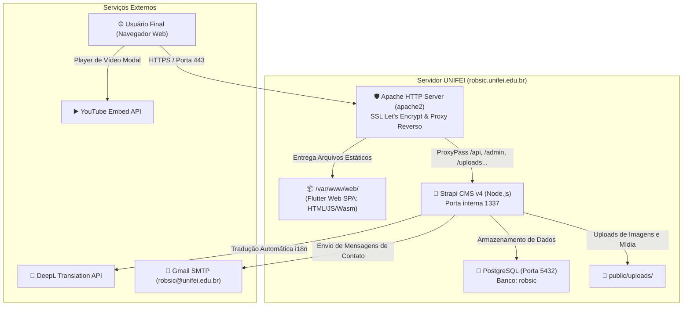

# 🌐 Explicação: Visão Geral da Arquitetura do Sistema RobSIC

> **Finalidade:** Apresentar a visão macro do ecossistema de software do RobSIC, mapeando servidores, protocolos, bancos de dados e fluxo de dados entre os componentes.

---

## 1. Diagrama de Arquitetura da Solução

---

## 2. Componentes do Sistema

### 1. Apache HTTP Server (apache2 — Servidor Web & Reverse Proxy)
- **Localização dos Virtual Hosts:** `/etc/apache2/sites-available/api-robsic-strapi-le-ssl.conf` no servidor de produção.
- **Funções:**
  - Terminação SSL/HTTPS com certificados automatizados via Let's Encrypt (`certbot`).
  - Servir os arquivos compilados do Flutter Web de `/var/www/web/` sob o usuário `www-data`.
  - Atuar como Proxy Reverso (`mod_proxy` / `ProxyPass` e `ProxyPassReverse`) encaminhando requisições das rotas `/api`, `/admin`, `/uploads`, `/i18n`, `/translate`, etc. para a porta local `1337` do Strapi.

### 2. Frontend — Flutter Web SPA
- **Repositório:** [Robsic/site-robsic](https://github.com/Robsic/site-robsic)
- **Tecnologia:** Dart / Flutter Web compilado em modo CanvasKit / HTML.
- **Comportamento:** É uma Single Page Application (SPA). Uma vez carregada no navegador do usuário, ela consome os dados dinâmicos do Strapi via requisições HTTP REST assíncronas utilizando o cliente `Dio`.

### 3. Backend — Strapi Headless CMS v4
- **Repositório:** [Robsic/strapi-robsic](https://github.com/Robsic/strapi-robsic)
- **Tecnologia:** Node.js (v18 LTS), framework Strapi v4.9.2.
- **Funções:**
  - Painel administrativo intuitivo para docentes e coordenadores cadastrarem membros, fotos, notícias e artigos sem precisar alterar código.
  - API REST com suporte a paginação, filtros, ordenação e publicação imediata (`draftAndPublish`).
  - Internacionalização via `@strapi/plugin-i18n` com tradução assistida pelo provedor DeepL.

### 4. Banco de Dados — PostgreSQL
- Armazena todas as tabelas relacionais de membros, publicações, projetos, permissões de usuários e metadados de arquivos.

### 5. Serviços Externos
- **DeepL API:** Traduz automaticamente textos cadastrados em português para o inglês, economizando tempo dos pesquisadores.
- **Gmail SMTP:** Roteia as mensagens preenchidas no formulário de contato do site diretamente para a caixa de entrada institucional `robsic@unifei.edu.br`.
